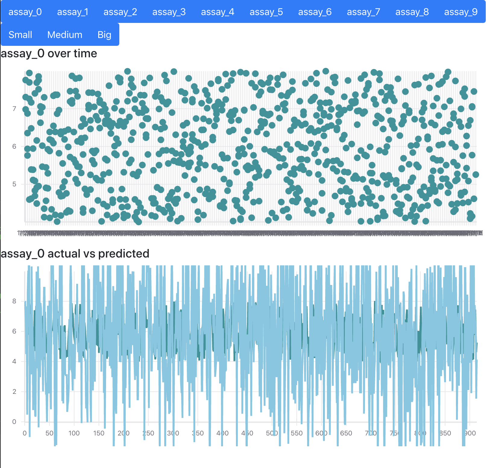
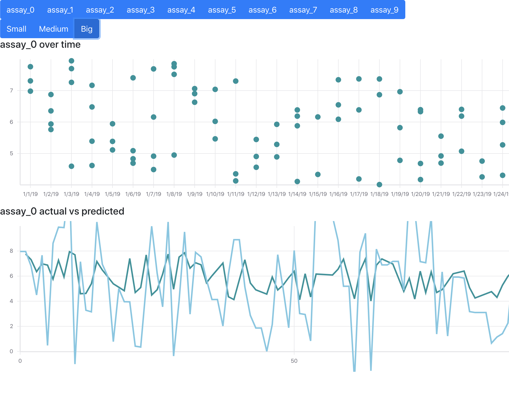

# Compounds
Application built with the MERN stack-- MongoDB, Express, React, and Node.js

Other noteworthy packages include react-vis from Uber, Mongoose, and Bootstrap

## Database

MongoDB is set to run locally on 3000 (and React on 8000). It serves up an API that returns JSON on localhost:3000/api.json

### Schema

The following is the BSON schema written for Mongoose to understand

```
{
  smiles : String,
  identifier : String,
  date : String,
  assay_0 : mongoose.Schema.Types.Decimal128,
  assay_1 : mongoose.Schema.Types.Decimal128,
  assay_2 : mongoose.Schema.Types.Decimal128,
  assay_3 : mongoose.Schema.Types.Decimal128,
  assay_4 : mongoose.Schema.Types.Decimal128,
  assay_5 : mongoose.Schema.Types.Decimal128,
  assay_6 : mongoose.Schema.Types.Decimal128,
  assay_7 : mongoose.Schema.Types.Decimal128,
  assay_8 : mongoose.Schema.Types.Decimal128,
  assay_9 : mongoose.Schema.Types.Decimal128,
  model_for_assay_0 : mongoose.Schema.Types.Decimal128,
  model_for_assay_1 : mongoose.Schema.Types.Decimal128,
  model_for_assay_2 : mongoose.Schema.Types.Decimal128,
  model_for_assay_3 : mongoose.Schema.Types.Decimal128,
  model_for_assay_4 : mongoose.Schema.Types.Decimal128,
  model_for_assay_5 : mongoose.Schema.Types.Decimal128,
  model_for_assay_6 : mongoose.Schema.Types.Decimal128,
  model_for_assay_7 : mongoose.Schema.Types.Decimal128,
  model_for_assay_8 : mongoose.Schema.Types.Decimal128,
  model_for_assay_9 : mongoose.Schema.Types.Decimal128
}
```

This BSON object is the MongoDB equivilent of a sql row.

The schema makes no use of the first row in the .csv. Maybe later.

### Data Loading

The UI can't write to the database (yet). Given a .csv it will have to be uploaded via mongoimport in the terminal (not the Mongo shell).

In my case `<databaseName>` was compoundsDB and I used one `<collectionName>` called compounds.

`$ mongoimport -d <databaseName> -c <collectionName> --type csv --file <filename>.csv --headerline`

## Run Locally

### Installation

You'll need to install the node packages for both the server and the client

```
npm install
cd client
npm install
```

Similarly you'll have to start both the server and the client

```
npm start
cd client
npm start
```

Locally the client will run on 8000 and the server will run on 3000

### Database Connection

In server.js, this line points to the database.

```
mongoose.connect(process.env.MONGODB_URI || "mongodb://localhost:27017/compoundsDB",
{useNewUrlParser: true, useUnifiedTopology: true})
```

mongodb://localhost:27017/compoundsDB is the location of my local database. This will change in production or if you named your database something else. 

## UI

Select the assay at the top, then select a zoom level.

The top graph shows the progress of an assay over time. The x-axis is time and the y-axis is measured values.

The bottom graph shows predicted vs actual results for a given assay. Reality is in red, and the prediction is in blue.

### Small


### Big

